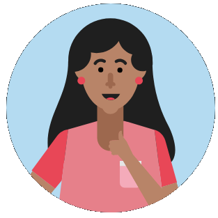

# Project Superior 

This is the next iteration of the Hanna Bot geared towards engaging with students at hackathon events.

## Features
* Automatically issuing Azure codes
* Mentor roster
* Project Tracking
* Student Inquiry Tracking

  